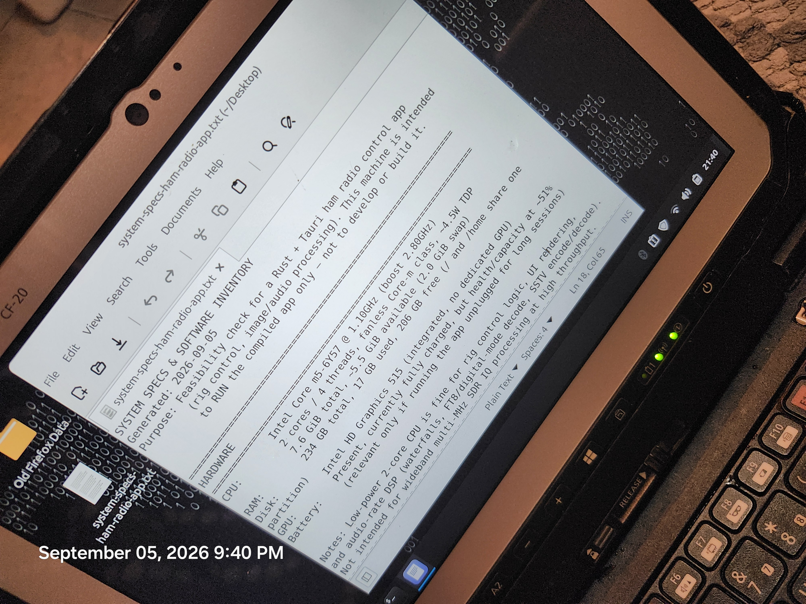
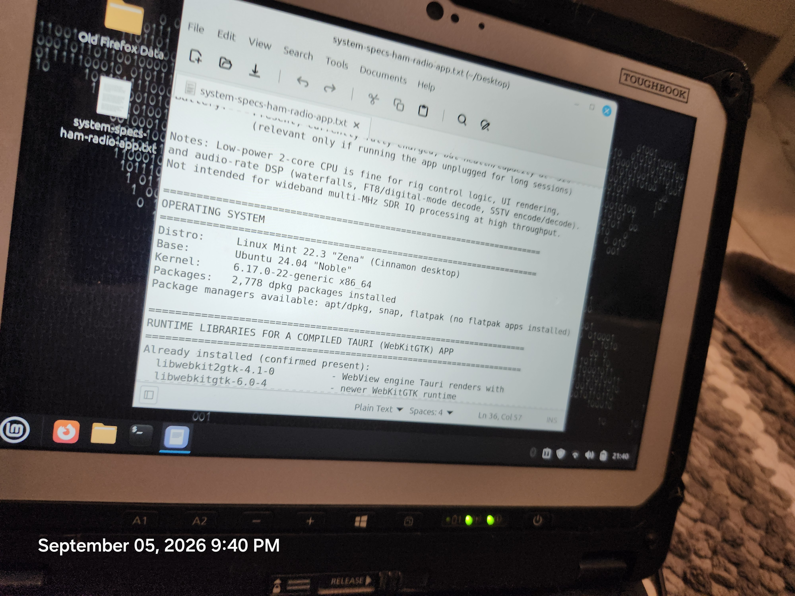
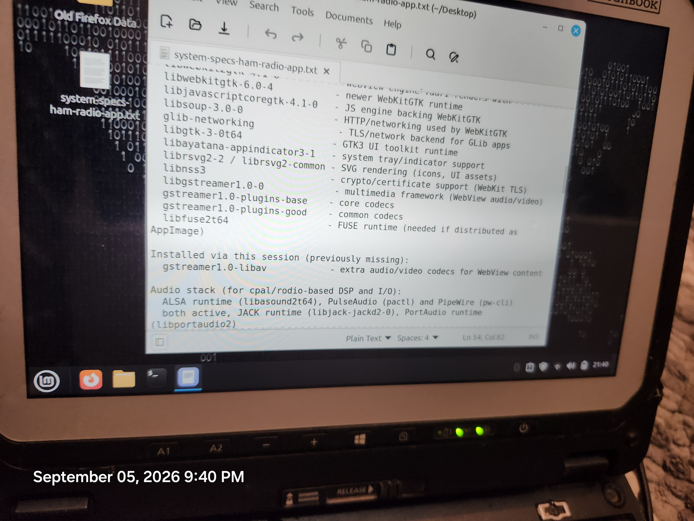
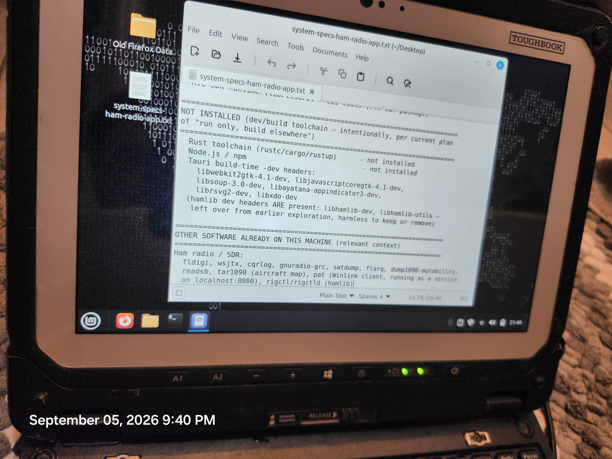
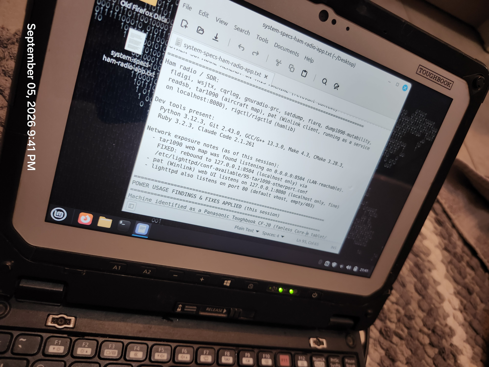
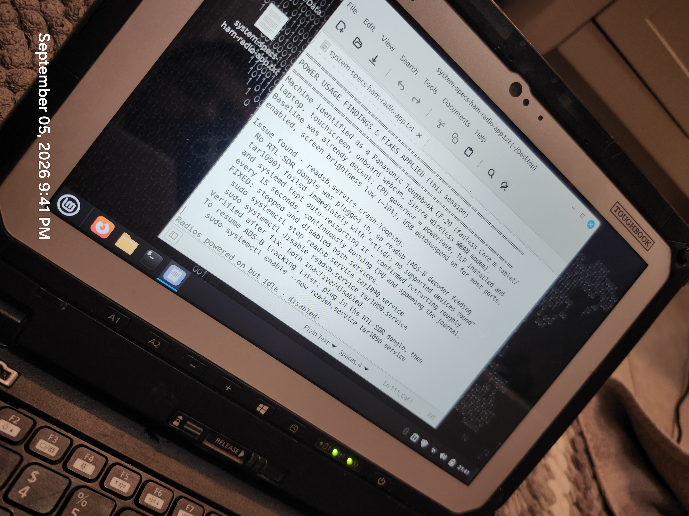
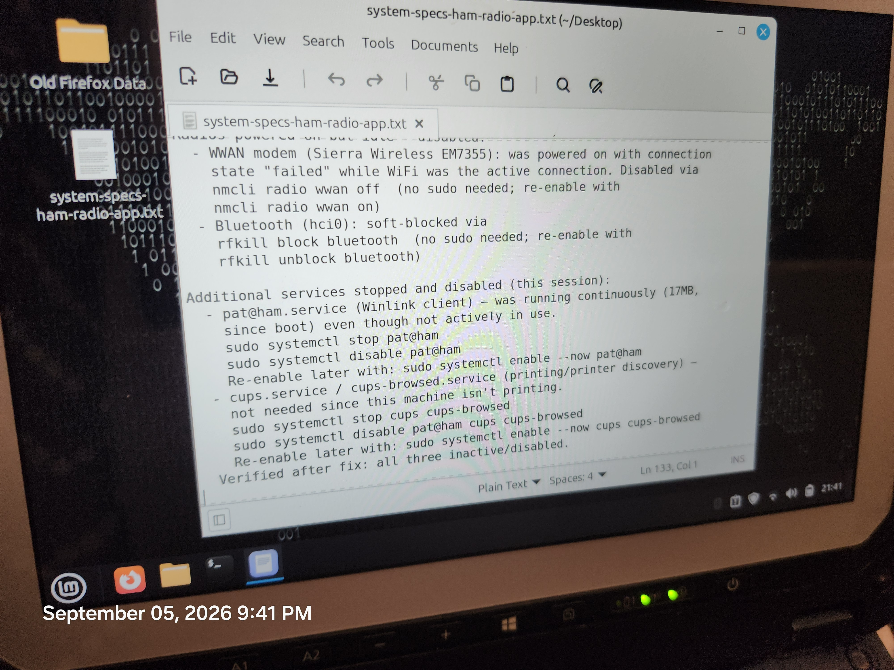
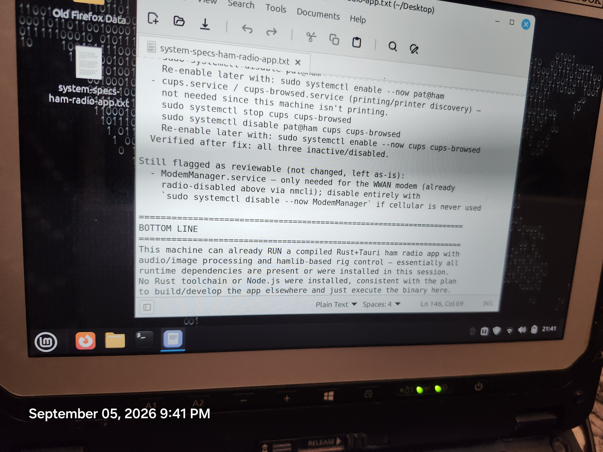

# CF-20 Feasibility Check — Photos

Photos of `system-specs-ham-radio-app.txt`, a feasibility check for running the
compiled Sparrow (Rust + Tauri ham radio) app on a Panasonic Toughbook CF-20.

